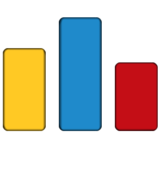

  

# Hey , I'm [Amin!](https://www.linkedin.com/in/aminyasser/) 

 

 
 

#  About me

- 🎓 Computer Science graduate <a href="https://sci.alexu.edu.eg/index.php/en/">@Faculty of Science Alexandria University</a> 

- ⚡ I am passionate about Back-End Development and Competitive Programming. 

- 📖 I'm currently Studying Algorithms and Database Systems

